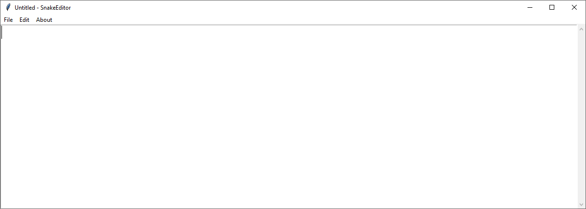

# SnakeEditor

*A simple, lightweight and free to use Python-made text editor*

## Requirements:

[Python 3](https://www.python.org/) <br />
[Tkinter library](https://wiki.python.org/moin/TkInter)

## How to open SnakeEditor in Windows: 

Open cmd (Command Prompt) in the folder where SnakeEditor is located and type: ```python SnakeEditor.py```
